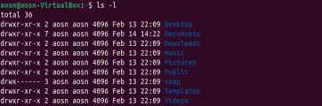
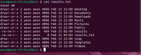
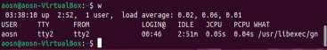

# Lab 4 – CLI and Shell Scripting

Practise usage of shell on Ubuntu Virtual machine. 

## List Commands 

| __Input__                     | __Output__                    |
| :---                          |       ---:                    |
| What OS used?                 | Ubuntu                        |

What is the computer name?

| Command                       | Output                        | 
| :---                          |      ---:                     |
| hostname                      | aosn-VirtualBox               | 

What directory are you currently in?

| Command                       | Output                        | 
| :---                          |      ---:                     |
| pwd                           | /home/aosn/Documents          | 

Go to the Documents directory:

| Command                       | Output                        | 
| :---                          |     :---:                     |
| cd Documents/                 |                               | 
| pwd                           | /home/aosn/Documents          | 

Create a folder named Lab4 in the Documents directory:

| Command                       | Output                        | 
| :---                          |      ---:                     |
| mkdir Lab4                    |                               |
| ls                            | Lab4                          |

In the newly created Lab4 folder, create 3 new folders named Part1, Part2, Part3:

| Command                       | Output                        | 
| :---                          |      ---:                     |
| cd Lab4                       |                               |
| mkdir Part1                   |                               |
| mkdir Part2                   |                               |
| mkdir Part3                   |                               |
| ls                            | Part1     Part2     Part3     |

Create a text file named classlist.txt in the Part1 folder. First list what directory you are in, then how to get to the Part1 folder and how to create the new file.

| Command                   | Output                            | 
| :---                      |      ---:                         |
| cd Part1                  |                                   |
| pwd                       | /home/aosn/Documents/Lab4/Part1   |
| touch classlist.txt       |                                   |
| ls                        | classlist.txt                     |

Create a text file named modules.txt in the Part2 folder. First list what directory you are in, then how to get to the Part2 folder and how to create the new file.

| Command                   | Output                            | 
| :---                      |      ---:                         |
| pwd                       | /home/aosn/Documents/Lab4/Part1   |
| cd ..                     |                                   |
| pwd                       | /home/aosn/Documents/Lab4         |
| cd Part2/                 |                                   |
| pwd                       | /home/aosn/Documents/Lab4/Part2   |
| touch modules.txt         |                                   |
| ls                        | modules.txt                       |

Create a text file named results.txt in the Part3 folder. First list what directory you are in, then how to get to the Part3 folder and how to create the new file.

| Command                   | Output                            | 
| :---                      |      ---:                         |
| pwd                       | /home/aosn/Documents/Lab4/Part2   |
| cd ..                     |                                   |
| pwd                       | /home/aosn/Documents/Lab4         |
| cd Part3                  |                                   |
| pwd                       | /home/aosn/Documents/Lab4/Part3   |
| touch results.txt         |                                   |
| ls                        | results.txt                       |

Go to the root directory:

| Command                   | Output                            | 
| :---                      |      ---:                         |
| pwd                       | /home/aosn/Documents/Lab4/Part3   |
| cd ..                     |                                   |
| pwd                       | /home/aosn/Documents/Lab4         |
| cd ..                     |                                   |
| pwd                       | /home/aosn/Documents              |
| cd ..                     |                                   |
| pwd                       | /home/aosn                        |
| cd ..                     |                                   |
| pwd                       | /home                             |
| cd ..                     |                                   |
| pwd                       |                                   |

List all the files and folders in the root directory:

| Command   | Output                                                        | 
| :---      |      ---:                                                     |
| ls        | Desktop Downloads Documents Music Pictures Public  Snap Templates Videos|

List all the files and folders in the root directory showing the file permissions:

| Command            | Output                                    | 
| :---               |      ---:                                 |
| ls -l              | |

Store the results the “List all the files and folders in the root directory showing the file permissions” and store this in the results.txt folder created earlier.

| Command            | Output                                   | 
| :---               |      ---:                                |
| ls -l> results.txt |                                          |
| ls                 | Desktop Downloads Pictures Snap Videos Documents Music Public results.txt Templates|

How many characters are in the file results.txt

| Command                       | Output                        | 
| :---                          |      ---:                     |
| wc -l results.txt             | 101 results.txt               |

How many lines are in the file results.txt

| Command                       | Output                        | 
| :---                          |      ---:                     |
| wc -w results.txt             | 12 results.txt                |

In the terminal window display the content of the results.txt file

| Command                        | Output                                   | 
| :---                           |      ---:                                |
| cat results.txt                |  |

What user is currently logged into the terminal window:

| Command                       | Output                                    | 
| :---                          |      ---:                                 |
| w                             |  |

Remove the file named classlist.txt

| Command           | Output                                                | 
| :---              |      ---:                                             |
| rm results.txt    |                                                       |
| ls                |Desktop Downloads Pictures Snap Videos Documents Music Public Templates|

Move the file named results.txt to the Lab4 folder.

| Command                       | Output                                    | 
| :---                          |      ---:                                 |
| ls                            |Desktop Downloads Pictures Snap Videos Documents Music Public Templates|
| ls -l                         | |
| ls -l> results.txt            |                                           |
| ls                            |Desktop Downloads Pictures Snap Videos Documents Music Public results.txt Templates|
| mv results.txt Documents/Lab  |                                           |
| ls                            | Part1 Part2 Part3 results.txt             |

What is the IP address of your machine? You may need to install a program for this (maybe)

| Command                          | Output                                 | 
| :---                             |      ---:                              |
| hostname --all-ip-address        | 10.8.2.15                              |

What process(program) has a process id (PID) of 1?#

| Command                       | Output                        | 
| :---                          |      ---:                     |
|                               |                               |

What command shuts the OS down? Make sure to save all your files before running this command!!

| Command                       | Output                        | 
| :---                          |      ---:                     |
| sudo shutdown -r              |                               |

